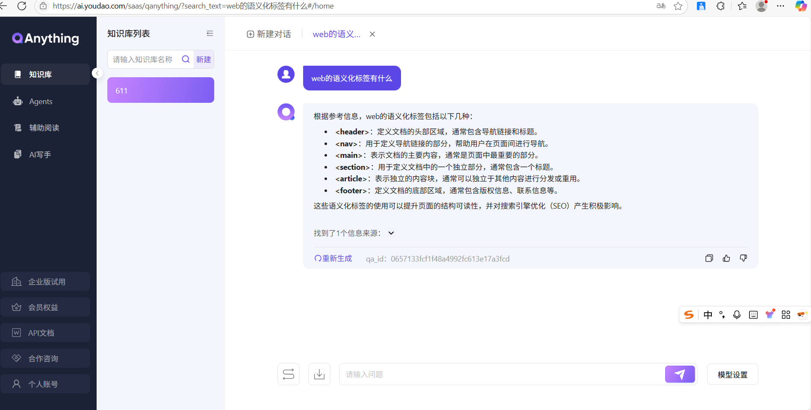
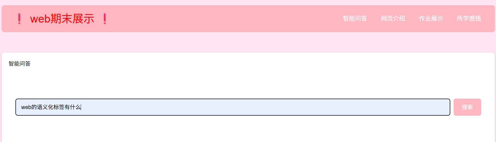
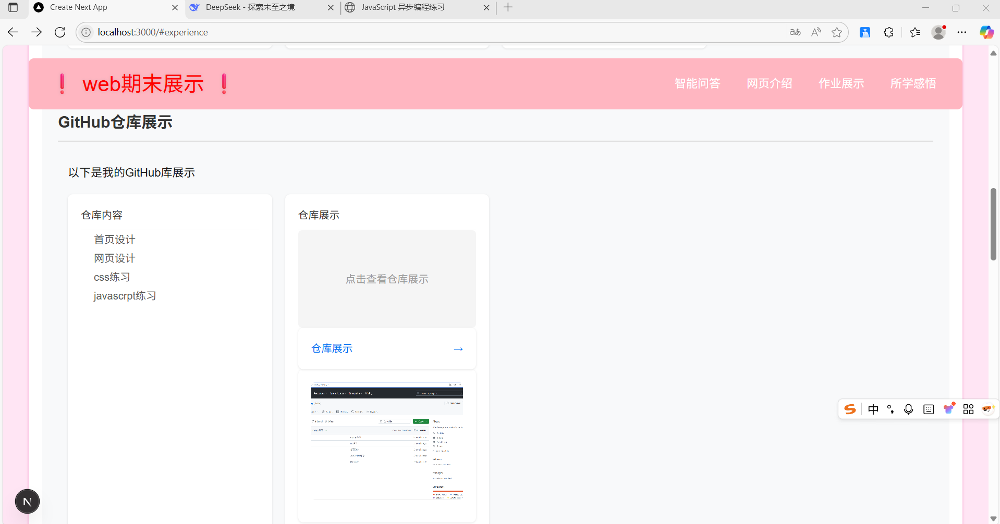
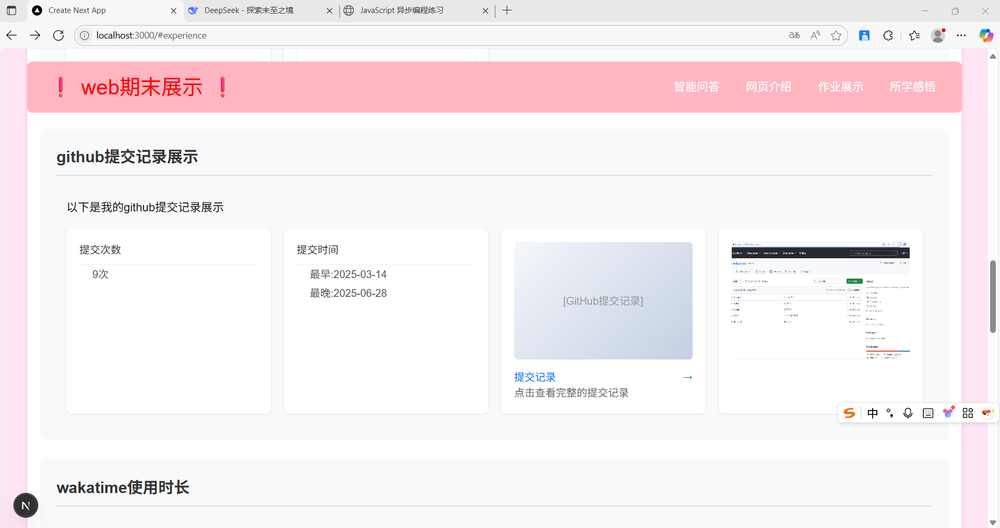
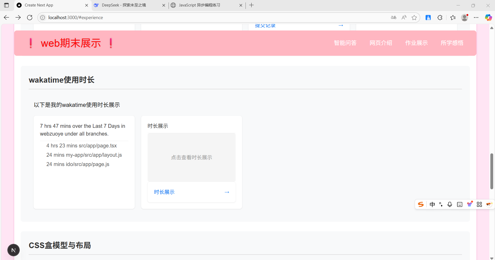
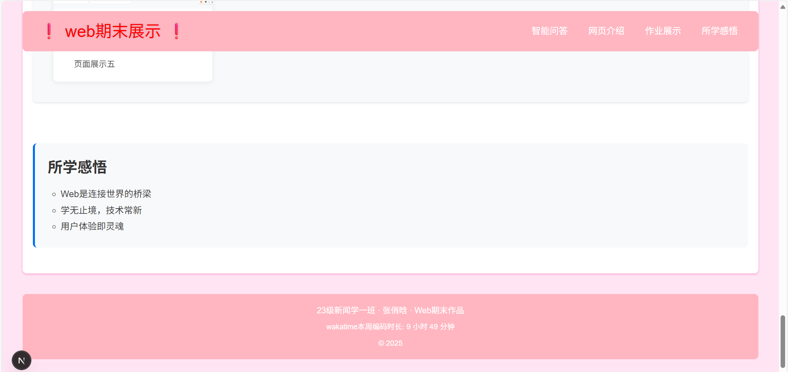

# Web课程期末项目

## 项目简介
这是Web期末展示
首页设计与开发
GitHub仓库展示
github提交记录
wakatime使用时长
css盒模型与布局
next.js全栈开发

## 功能模块
1. **QAnything 智能问答**：集成本地知识库问答系统
2. **WakaTime 统计**：展示编程学习时长数据
3. **课程练习整合**：整合所有课程练习作业
## 项目结构
```
├── src
│  ├── app
│   ├── qanything
│   │   ├── page.tsx
│   │   └── styles.css
│   ├── wakatime
│   │   ├── page.tsx
│   │   ├── api
│   │   │   └── wakatime.ts
│   │   └── styles.css
│   └── courses
│       ├── page.tsx
│       ├── styles.css
│       └── components
│           ├── course-card.tsx
│           └── course-list.tsx
│  ├── page.tsx
│  ├── layout.tsx
├── components
│   ├── Qanything.js
│   ├── footer.js
├── lib
│   ├── wakatime.ts
├── public
│   ├── images
│   │   ├── 智能问答页面展示.png
│   │   ├── 智能问答展示1.png
│   │   ├── wakatime-stats.png
│   │   └── 课程练习.png
├── styles
├── globals.css 
├── package.json
├── tsconfig.json
└── next.config.js
```
---

## 运行截图

### QAnything 智能问答系统




### WakaTime 编程统计


### 课程管理系统


### 响应式布局


### 响应式布局


### 响应式布局


## 技术实现

### 智能问答系统
```typescript
// app/qanything/page.tsx
export default function QAPage() {
  return (
    <div className="h-[90vh]">
      <iframe 
        src="https://qanything.tech/demo"
        className="w-full h-full border rounded-lg"
      />
    </div>
  )
}

## QAnything 集成

### 集成路径
`/app/qanything`
选择原因：
1. 独立路由便于维护
2. 与主应用逻辑分离
3. 便于后续扩展为完整功能模块

## WakaTime API 集成

### 接入方法
1. 在 `lib/wakatime.ts` 中实现 API 客户端
2. 通过 Next.js API 路由 `/api/wakatime` 提供数据
3. 前端使用 SWR 获取并展示数据

### 关键代码
```typescript
// 获取编程统计数据
export async function getWakaTimeStats() {
  const response = await fetch(
    `https://wakatime.com/api/v1/users/current/stats`,
    {
      headers: {
        Authorization: `Basic ${process.env.WAKATIME_API_KEY}`,
      },
    }
  );
  return response.json();
}

