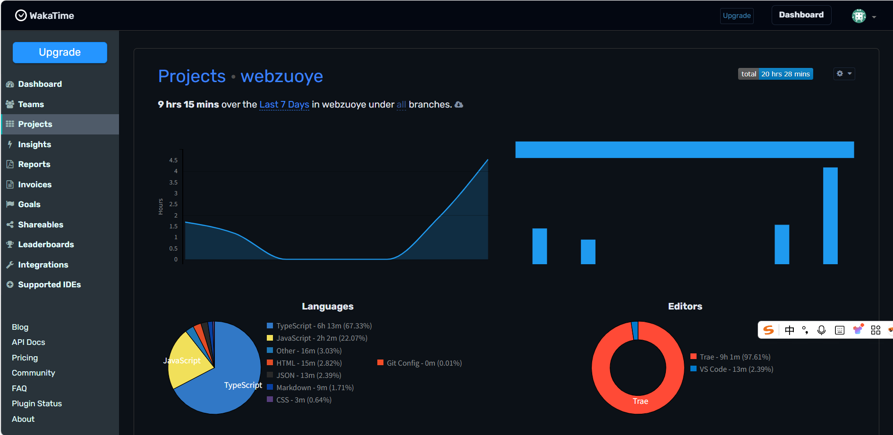
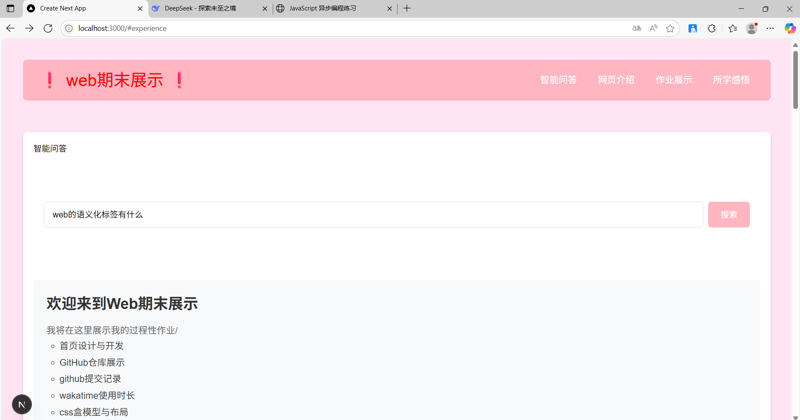
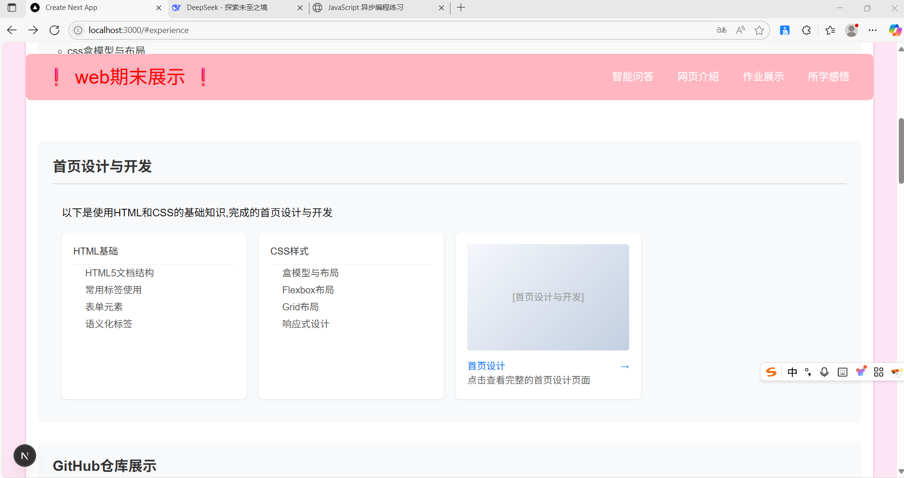
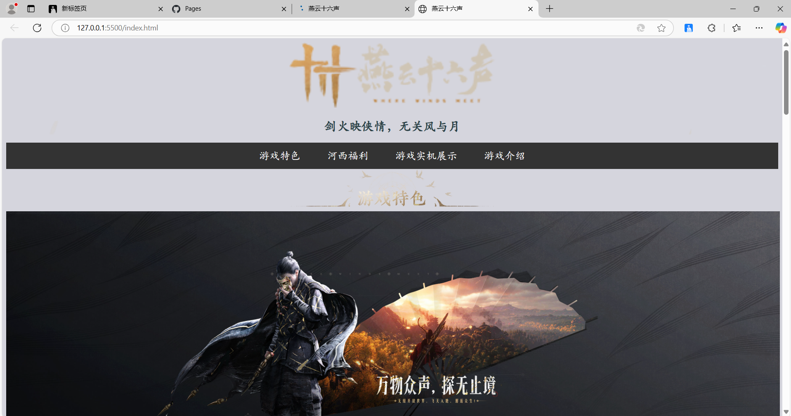
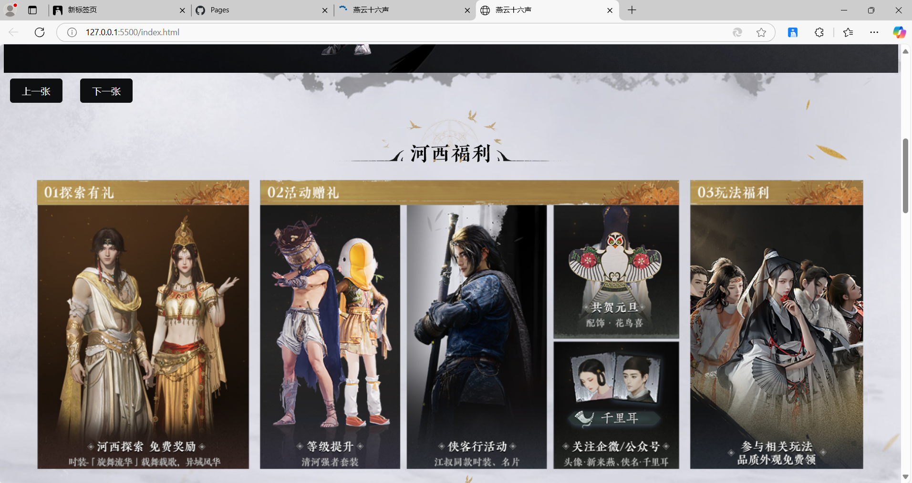
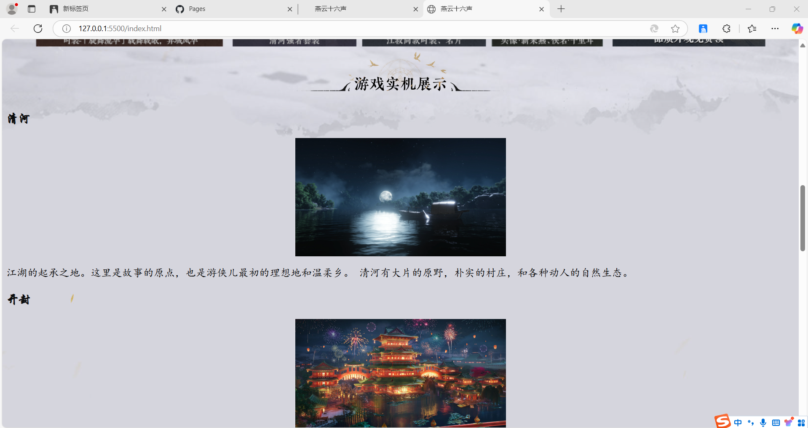
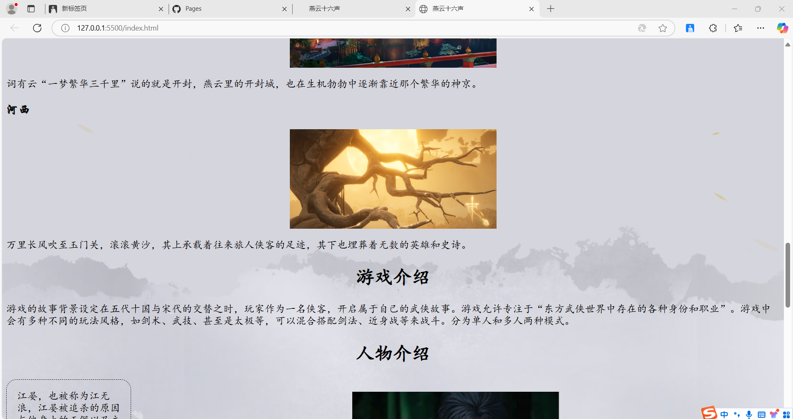
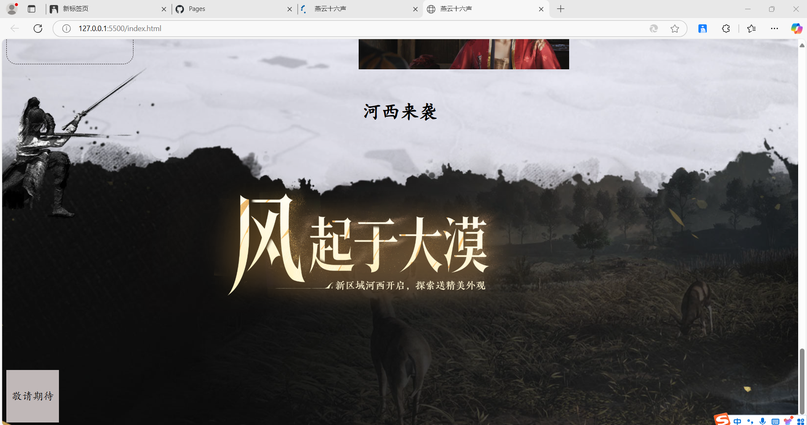
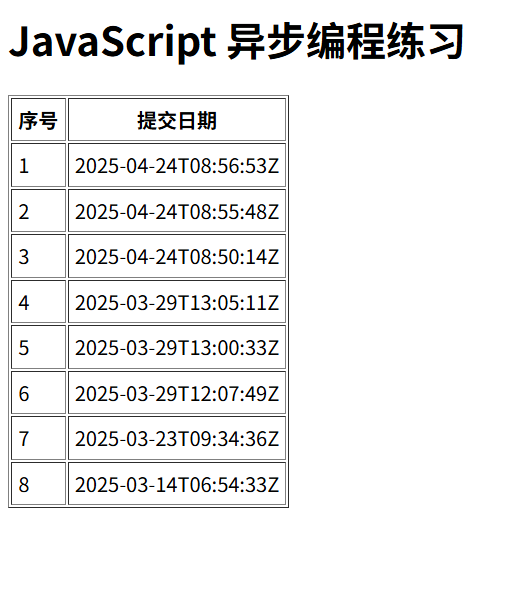

# Web课程期末项目

## 项目简介
这是我的Web期末作业展示
分别展示了六个部分：
首页设计与开发
GitHub仓库展示
github提交记录
wakatime使用时长
css盒模型与布局
next.js全栈开发

## 功能模块
1. **QAnything 智能问答**：集成本地知识库问答系统
2. **WakaTime 统计**：展示编程学习时长数据
3. **课程练习整合**：整合所有课程练习作业

## Qanything集成路径和实现细节
1. 采用基础路径，利用iframe嵌入Qanything的演示页面
2. 选择原因：
   - 制作过程简单，无需复杂配置
   - 便于后续扩展为完整功能模块
## Qanything运行截图
### QAnything 智能问答系统


## wakatime API 集成方法
1. 在.env.local中写入自己的api
2. 在页脚处，通过useEffect钩子获取模拟的WakaTime数据，再使用document.getElementById定位页脚元素，将总秒数转换为小时+分钟的展示格式
### WakaTime时长统计运行截图
### WakaTime 时长统计




## next.js项目结构
```
├── src
│  ├── app
│   ├── qanything
│   │   ├── page.tsx
│   │   └── styles.css
│   ├── wakatime
│   │   ├── page.tsx
│   │   ├── api
│   │   │   └── wakatime.ts
│   │   └── styles.css
│   └── courses
│       ├── page.tsx
│       ├── styles.css
│       └── components
│           ├── course-card.tsx
│           └── course-list.tsx
│  ├── page.tsx
│  ├── layout.tsx
├── components
│   ├── Qanything.js
│   ├── footer.js
├── lib
│   ├── wakatime.ts
├── public
│   ├── images
│   │   ├── 智能问答页面展示.png
│   │   ├── 智能问答展示1.png
│   │   ├── wakatime时长展示.png
│   │   └── 页面展示1.png
│   │   └── 页面展示2.png
│   │   └── 页面展示3.png
│   │   └── 页面展示4.png
│   │   └── 页面展示5.png
│   │   └── yemian1.png
│   │   └── yemian2.png
│   │   └── yemian3.png
│   │   └── yemian4.png
│   │   └── yemian5.png
│   │   └── tijiao.png
├── styles
├── globals.css 
├── package.json
├── tsconfig.json
└── next.config.js
```
---

## 所有运行截图展示

### QAnything 智能问答系统


### WakaTime 时长统计


### 课程导航页面


### 详细作业展示跳转页面


### 响应式布局


### 页脚展示


### 其他过程性作业截图







## 运行指南
1.导航栏点击可跳转到相应位置
2.智能问答处，搜索问题点击可跳转到Qanything的演示页面
3.课程作业展示处，点击可跳转到相应作业地址
4.总体采用知识点+作业展示的形式


